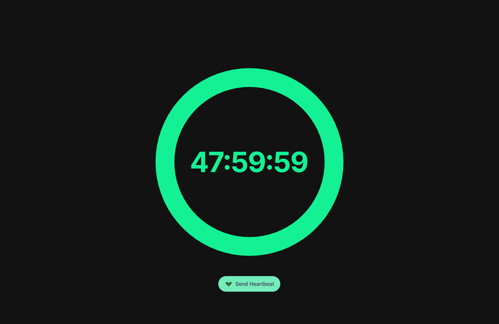
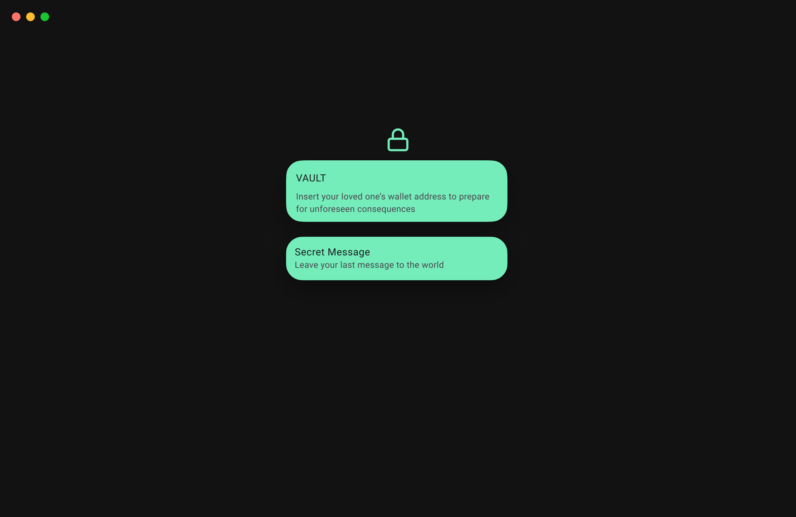
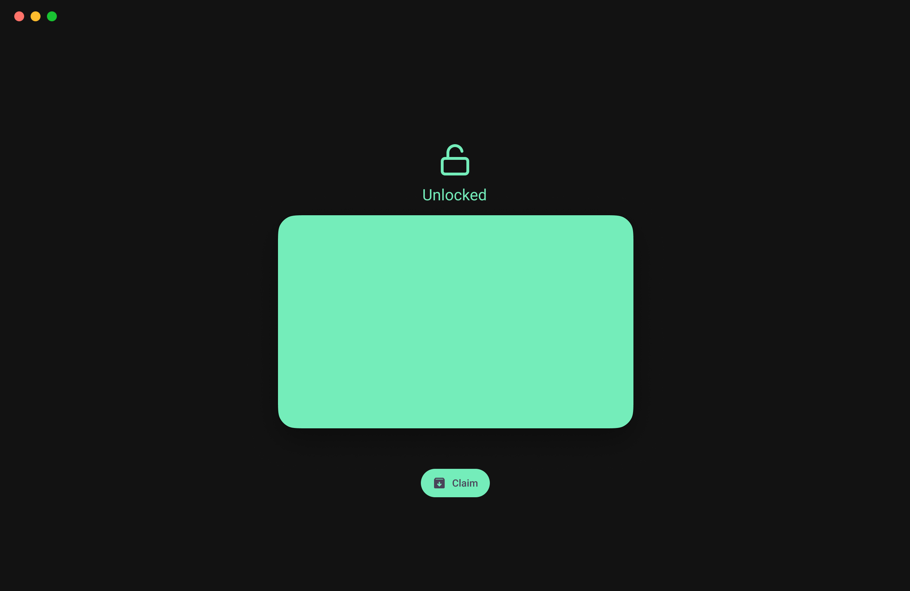

# # Last Signal: Decentralized Digital Inheritance Protocol ⏳

> **"Your final message to the world, secured by Solana."**

##  Introduction
**Last Signal** is a privacy-preserving "Dead Man's Switch" built on the Solana blockchain. It ensures your digital assets and secrets are securely transferred to a designated beneficiary only if you become inactive for a specific period.

Unlike traditional wills that require expensive lawyers and intermediaries, Last Signal runs entirely on-chain using **Rust & Anchor smart contracts**, guaranteeing trustless execution and absolute privacy.

---

## 📱 User Interface Concept (Cyberpunk Vault)
We have designed a high-fidelity "Digital Vault" interface to provide a seamless and secure user experience.

| 1. Dashboard (Heartbeat) | 2. Create Vault | 3. Asset Unlock |
| :---: | :---: | :---: |
|  |  |  |
| **Real-time Countdown**<br>Interactive timer displaying remaining time before the switch triggers. | **Secure Setup**<br>Input beneficiary wallet and encrypted secret message. | **Claim Access**<br>Once the timer expires, the beneficiary gains access to the vault. |

---

##  Key Features

### 1.  Secure Time Capsule (PDA)
- Creates a secure on-chain vault using **Program Derived Addresses (PDA)**.
- Only the owner can reset the timer; only the beneficiary can claim the assets.

### 2.  Heartbeat Mechanism (Proof of Life)
- Owners send a "Heartbeat" transaction to prove they are active.
- Each heartbeat resets the expiration timer (e.g., extends by 100 slots).

### 3.  Trustless Inheritance
- If the timer hits zero (owner is inactive), the smart contract **automatically unlocks**.
- The beneficiary can claim the assets or read the secret message without permission from any third party.

---

##  Tech Stack

* **Network:** Solana Devnet
* **Smart Contract:** Rust, Anchor Framework
* **Testing:** TypeScript (Mocha/Chai)
* **Design:** Figma (High-fidelity Prototyping)

---

##  Future Roadmap

We plan to expand Last Signal into a full-scale inheritance platform:

* **Phase 1 (Current):** Basic Dead Man's Switch logic & UI Design.
* **Phase 2 (Planned):** **Multi-Sig Security** – Requires approval from a trusted third party (e.g., lawyer, family) + timer expiration.
* **Phase 3 (Planned):** **AI Activity Verification** – AI agent analyzes on-chain activity to auto-renew the heartbeat, preventing accidental lockouts.
* **Phase 4 (Planned):** **Token Support** – Support for SPL Tokens and NFT inheritance.

---

##  How to Test (Devnet)

This project is deployed and verified on the Solana Devnet.

### 1. Prerequisites
- Node.js & Yarn
- Rust & Cargo
- Solana CLI & Anchor CLI

### 2. Run Tests
```bash
# Clone the repository
git clone [https://github.com/YOUR_GITHUB_ID/last-signal-hackathon.git](https://github.com/YOUR_GITHUB_ID/last-signal-hackathon.git)

# Install dependencies
yarn install

# Build the program
anchor build

# Run the test suite (Create -> Heartbeat -> Claim)
anchor test
